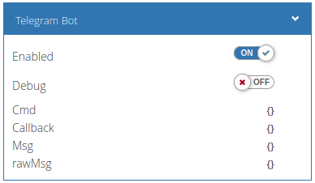

# telegram2wb
## Описание



Телеграм-бот на *wb-rules*:

- Реагирует только на сообщения от известных ему пользователей.
- Одновременно с ботом могут работать несколько пользователей — он ответит каждому индивидуально.
- Можно добавить бота в групповой чат, тогда сообщения бота будут видны всем. Бот не понимает, когда к нему обращаются и ставит в очередь все команды в чате. Но вы можете обработать это на стороне логики, анализируя *cmd.chatType*, *cmd.mentions* и *bot.getUserName()*.
- Ведёт очередь команд — это полезно, если бот не мог связаться с сервером, а команды продолжали поступать.
- Понимает несколько команд в одном сообщении и их аргументы.
- Может отправлять сообщения, документы и фото. Фото и документы отправить можно только по одному в каждом сообщении.
- Игнорирует сообщения без команды.

Бот создаёт виртуальное устройство *telegram2wb* (Telegram Bot) с топиками:

- Enabled — переключает состояние бота.
- Debug — управляет выводом отладочных сообщений.
- Cmd — топик, куда бот записывает принятые команды.
- Msg — топик, откуда бот читает сообщения, которые нужно отправить.

Команды и сообщения должны быть в формате JSON.

В боте нет логики обработки команд — это ваша задача. Подробнее смотрите в разделе «Принцип работы», а простой пример можно найти в файле `example/telegram2wb-logic.js`.

## Установка и настройка

Бот выполнен модулем wb-rules, поэтому для установки скопируйте файл `src/telegram2wb.js` в папку `/etc/wb-rules-modules/`.

После этого подключите модуль к скрипту wb-rules и инициализируйте бота:

```javascript
var bot = require("telegram2wb"); // подключаем модуль

token = ""; // Токен бота, можно узнать у @BotFather 
allowUsers = ["username"]; // Пользователи, которым разрешено общаться с ботом. Можно указать несколько: ["user1", "user2", …]

bot.init(token, allowUsers);
```

Если у вас несколько ботов, то вы можете использовать один модуль, для этого при инициализации нужно указать разные токены и имена виртуальных устройств:

```javascript
// Скрипт 1.js
var bot = require("telegram2wb"); // подключаем модуль
bot.init("token1", ["allowUser1"], "device-name-1");

// Скрипт 2.js
var bot = require("telegram2wb"); // подключаем модуль
bot.init("token2", ["allowUser1"], "device-name-2");
```

В этом случае каждый бот будет работать самостоятельно и не знать о существании другого.

Для удобства модуль экспортирует несколько переменных и функций, которые использовать не обязательно:

```javascript
bot.parseMode; // режим оформления отправляемых сообщений
bot.pollInterval; // интервал опроса
bot.mqttCmd; // имя топика команд
bot.mqttMsg; // имя топика сообщений
bot.getUserName() // имя бота, полученное с сервера в формате @username
```

Пример работы с ботом смотрите в файле `example/telegram2wb-logic.js`.

## Принцип работы

Бот запрашивает с сервера сообщения, выбирает из них те, что с командами и упаковывает команды в структуру:
```javascript
cmd = {
    chatId: chatId, //chatId пользователя, отправившего сообщение
    chatType, // тип чата — group или private
    mentions, // упоминания — массив упоминаний в сообщении ["@username1", "@username2"]
    messageId: messageId, //идентификатор сообщения
    command: command, // полученная команда
    args: args // аргументы команды
  }
```

После разбора бот помещает команду в очередь. Если сообщение содержало несколько команд, то каждая из них будет помещена в очередь отдельно.

За аргумент бот принимает все символы, идущие после команды и до следующего слеша. Начальные и конечные пробелы отбрасываются. Поэтому, если в аргументе есть слеш, например, путь к файлу, то аргумент нужно заключить в двойные кавычки:

```
/getfile "/path/to/file"
```

Если в топике виртуального устройства *Cmd* записано `{}` и в очереди есть сообщения, то бот извлекает из очереди самую раннюю команду и публикует её в топик *Cmd* в JSON формате:

```JSON
{"chatId":662750197,"messageId":2969,"command":"/command","args":"argument"}
```

Вы должны в своих скриптах подписаться на изменение топика *Cmd*, считывать оттуда команды и после чтения записывать в топик `{}`, чтобы бот мог поместить туда следующую команду.

Чтобы отправить сообщение, запишите его в JSON-строку:

```json
{
    "chatId":662750197, 
    "text":"Текст сообщения", 
    "messageId":2969,
    "document":"/path/to/file",
    "photo":"/path/to/file"
}
```

Обязательные параметры:

- chatId — chatId пользователя, которому нужно отправить сообщение
- text —  текст сообщения / описание документа или фото

Необязательные параметры:

- messageId — идентификатор сообщения, на которое нужно ответить
- document —  путь к документу, который нужно отправить
- photo — путь к фото, которое нужно отправить

Опубликуйте JSON-строку с сообщением в топике *Msg*. Бот получит строку, вытащит сообщение и отправит его, а в топик запишет `{}`.
