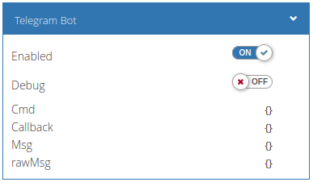

# telegram2wb
## Описание



Телеграм-бот на *wb-rules*:

- Реагирует только на сообщения от известных ему пользователей.
- Одновременно с ботом могут работать несколько пользователей — он ответит каждому индивидуально.
- Можно добавить бота в групповой чат, тогда сообщения бота будут видны всем. Бот не понимает, когда к нему обращаются и выполняет все команды в чате.
- Ведёт очередь команд — это полезно, если бот не мог связаться с сервером, а команды продолжали поступать.
- Понимает несколько команд в одном сообщении и их аргументы.
- Может отправлять сообщения, документы и фото. Фото и документы отправить можно только по одному в каждом сообщении.
- Игнорирует сообщения без команды.

Бот создаёт виртуальное устройство *telegram2wb* (Telegram Bot) с топиками:

- Enabled — переключает состояние бота.
- Debug — управляет выводом отладочных сообщений.
- Cmd — топик, куда бот записывает принятые команды.
- Msg — топик, откуда бот читает сообщения, которые нужно отправить.

Команды и сообщения должны быть в формате JSON.

В боте нет логики обработки команд — это ваша задача. Подробнее смотрите в разделе «Принцип работы», а простой пример можно найти в файле `example/telegram2wb-logic.js`.

## Установка и настройка

Чтобы установить бота, пропишите настройки *token* и *users* в файле `src/telegram2wb.js` , а затем скопируйте его в папку со скриптами.

Пример работы с ботом смотрите в файле `example/telegram2wb-logic.js`.

## Принцип работы

Бот запрашивает с сервера сообщения, выбирает из них те, что с командами и разбирает команды в структуру:
```javascript
cmd = {
    chatId: chatId, //chatId пользователя, отправившего сообщение
    messageId: messageId, //идентификатор сообщения
    command: command, // полученная команда
    args: args // аргументы команды
  }
```

После разбора бот помещает команду в очередь. Если сообщение содержало несколько команд, то каждая из них будет помещена в очередь отдельно.

За аргумент бот принимает все символы, идущие после команды и до следующего слеша. Начальные и конечные пробелы отбрасываются. Поэтому, если в аргументе есть слеш, например, путь к файлу, то аргумент нужно заключить в двойные кавычки:

```
/getfile "/path/to/file"
```

Если топик виртуального устройства *Cmd* пуст и в очереди есть сообщения, то бот извлекает из очереди самую раннюю команду и публикует её в топик *Cmd* в JSON формате:

```JSON
{"chatId":662750197,"messageId":2969,"command":"/command","args":"argument"}
```

Вы должны в своих скриптах подписаться на изменение топика *Cmd*, считывать оттуда команды и после чтения опустошать топик, чтобы бот мог поместить туда следующую команду.

Чтобы отправить сообщение, вам нужно создать JSON-строку вида:

```json
{
    "chatId":662750197, //chatId пользователя, которому нужно отправить сообщение
    "text":"Текст сообщения", // текст сообщения / описание документа или фото    
    // далее параметры, которые можно пропустить
    "messageId":2969, // идентификатор сообщения, на которое нужно ответить
    "document":"/path/to/file", // путь к документу, который нужно отправить
    "photo":"/path/to/file" // путь к фото, которое нужно отправить
}
```

Строку нужно опубликовать в топике *Msg*. Бот получит строку, очистит топик и отправит сообщение.
