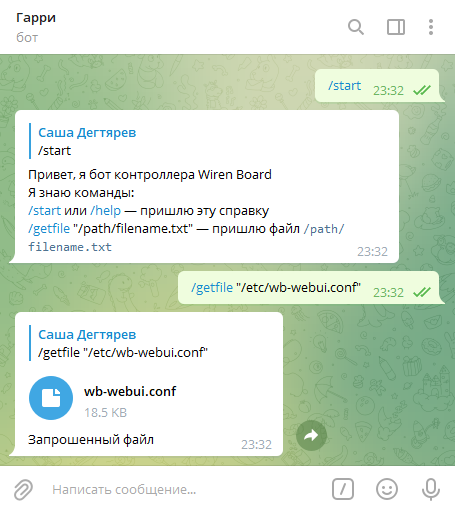

# telegram2wb-logic

## Описание

Пример работы с ботом telegram2wb.



В примере используется контроллер команд:

```javascript
defineRule("bot_controller", {
    asSoonAs: function () {
        return dev["telegram2wb/Cmd"];
    },
    then: function () {
        cmd = getCmd();

        switch (cmd.command) {
            case "/start":
            case "/help":
                cmdHelp(cmd)
                break;
            case "/getfile":
                cmdGetFile(cmd)
                break;
            default:
                cmdUnknown(cmd);
                break;
        }

    }
});
```

Контроллер команд следит за топиком `telegram2wb/Cmd`. 

Как только в топике появляется команда, контроллер забирает её, очищает топик и вызывает функцию, которая назначена команде.

Функции, начинающиеся с `cmd` — обработчики команд, которые принимают на вход объект команды *cmd*.

Также в примере есть четыре сервисные функции:

```javascript
getCmd() // забирает из топика команду, очищает топик, парсит полученный JSON и возвращает объект команды
sendMsg(chatId, text, replyTo) // формирует объект msg для отправки текстового сообщения
sendDoc(chatId, text, replyTo, document) // формирует объект msg для отправки файла
writeMsgToMqtt(msg) // преобразует объект msg в JSON и публикует в топике telegram2wb/Msg
```

